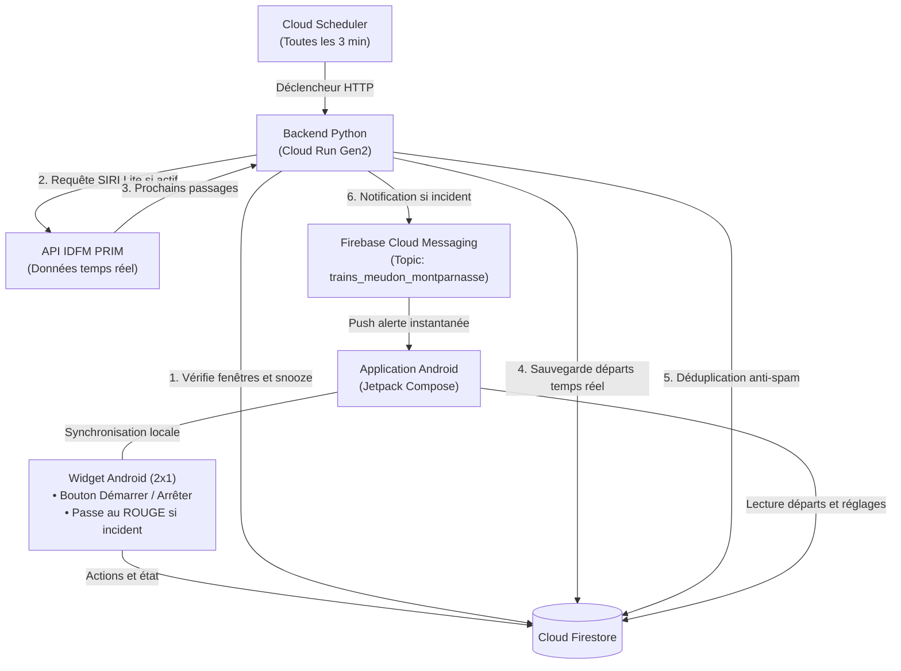

# 🚆 Null-Track — Surveillance & Alertes Transilien Ligne N

[](https://opensource.org/licenses/Apache-2.0)


**Null-Track** est un système intelligent et temps réel d'alerte et de surveillance pour les usagers de la **Ligne N du Transilien** (Gare de Meudon ⇄ Paris-Montparnasse / Banlieue).

Il combine un backend serverless sur Google Cloud, une application Android moderne en Jetpack Compose, et un widget d'écran d'accueil compact synchronisé en permanence.

---

## ✨ Fonctionnalités principales

- 📱 **Widget Android compact (2x1)** :
  - **Bouton d'action 1 clic** : Démarre ou arrête la surveillance à la demande (durée paramétrable, 1h par défaut).
  - **Alerte visuelle instantanée** : Le widget passe automatiquement au **ROUGE** (`🚨 PERTURBATION`) dès qu'une suppression ou un retard significatif (≥ 5 min) est détecté sur les prochains départs.
  - **Raccourci direct** : Un tap sur le widget ouvre instantanément l'application pour afficher l'ensemble des détails du trafic.
  - **Synchronisation continue** : L'état de surveillance et les données de trafic sont toujours synchronisés entre le widget et l'application.
- 📍 **Détection intelligente de la localisation** :
  - À Paris : oriente la surveillance vers **Paris ➔ Meudon** (retour).
  - Proche de Meudon : oriente la surveillance vers **Meudon ➔ Paris** (aller).
- 🔁 **Surveillance bidirectionnelle automatisée** :
  - Plage du **Matin** : Meudon ➔ Paris (07h00 - 09h30).
  - Plage du **Soir** : Paris ➔ Meudon (17h00 - 19h30).
  - Jours actifs configurables (lundi au vendredi par défaut).
  - Mode Pause / Veille (Snooze temporaire ou pour le reste de la journée).
- ⏱️ **Notifications Push FCM** : Alertes reçues en temps réel via Firebase Cloud Messaging lors d'incidents, avec sonnerie prioritaire et vibration.
- 🔍 **Consultation ponctuelle à la demande (On-Demand)** :
  - **Passerelle sécurisée** : L'application mobile n'appelle jamais l'API PRIM en direct mais passe par le backend proxy (`GET /departures`).
  - **Double niveau de cache TTL** : Cache serveur de 90 secondes (`DEPARTURES_CACHE_TTL_SECONDS = 90`) et throttle local client de 60 secondes pour préserver les quotas PRIM.
  - **Zéro consommation passive** : Dès que l'application est fermée hors heures de surveillance, aucun appel n'est émis.
- 📊 **Tableau de bord de statistiques & Télémétrie** :
  - Suivi en direct dans les paramètres de l'application : nombre de déclenchements (App vs Widget), contrôles programmés, alertes envoyées, ponctualité, et répartition des statuts HTTP de l'API PRIM (2xx, 4xx, 5xx).
- 🛡️ **Protection des quotas API & Anti-Spam** : Déduplication stricte des trains perturbés dans Cloud Firestore et cadencement intelligent des requêtes vers l'API Île-de-France Mobilités (PRIM).

---

## 🏗️ Architecture technique



---

## 📁 Structure du dépôt

```text
null-track/
├── backend/
│   ├── config.py              # Paramètres par défaut, gares, filtres & horaires
│   ├── monitor.py             # Appels API PRIM (SIRI Lite), détection retards et annulations
│   ├── firestore_client.py    # Gestion Firestore (déduplication, départs temps réel, planning)
│   ├── fcm_client.py          # Envoi des notifications push ciblées
│   ├── main.py                # Point d'entrée HTTP Cloud Run (/departures, /config, etc.)
│   ├── requirements.txt       # Dépendances Python
│   ├── Dockerfile             # Conteneurisation pour Cloud Run
│   └── .env.example           # Variables d'environnement locales
├── android/
│   ├── app/
│   │   ├── src/main/java/com/nulltrack/
│   │   │   ├── MainActivity.kt                  # Activité principale & gestion des intents
│   │   │   ├── data/
│   │   │   │   ├── DeparturesRepository.kt      # Dépôt des départs réels (cache local & synchro)
│   │   │   │   ├── ScheduleRepository.kt        # Dépôt du planning de surveillance
│   │   │   │   ├── AlertRepository.kt           # Historique local des alertes
│   │   │   │   ├── ScheduleConfig.kt            # Modèle de configuration horaire
│   │   │   │   └── TrainDeparture.kt            # Modèle des trains et statuts
│   │   │   ├── widget/
│   │   │   │   └── NullTrackWidgetProvider.kt   # Fournisseur du widget Android 2x1
│   │   │   ├── location/
│   │   │   │   └── LocationHelper.kt            # Détection de direction selon la position
│   │   │   ├── service/
│   │   │   │   └── NullTrackMessagingService.kt # Réception push FCM en arrière-plan
│   │   │   └── ui/                              # Interface déclarative Compose (Material 3)
│   │   └── build.gradle.kts
│   ├── gradlew                                  # Wrapper Gradle pour compilation CLI
│   └── build.gradle.kts
├── deploy/
│   └── deploy_gcp.sh          # Script de déploiement Cloud Run & Cloud Scheduler
├── firestore.rules            # Règles de sécurité Cloud Firestore
├── firebase.json              # Configuration Firebase
├── LICENSE                    # Licence Apache 2.0
└── README.md
```

---

## 🚀 Installation & Déploiement

### 1. Prérequis

- Un compte **[Île-de-France Mobilités (PRIM)](https://prim.iledefrance-mobilites.fr/)** pour obtenir une clé d'API gratuite (`apiKey`).
- Un projet **Google Cloud Platform (GCP)** avec facturation activée.
- Un projet **Firebase** lié à votre projet GCP.
- Java 17+ ou 21 et le SDK Android pour compiler l'application mobile.

---

### 2. Déploiement du Backend sur Google Cloud

Le script `deploy/deploy_gcp.sh` configure le service Cloud Run (Gen2) et le job Cloud Scheduler :

```bash
export GCP_PROJECT_ID="mon-projet-gcp"
export GCP_REGION="europe-west1"
export PRIM_API_KEY="ma-cle-api-prim"

chmod +x deploy/deploy_gcp.sh
./deploy/deploy_gcp.sh
```

Le Cloud Scheduler interroge l'endpoint du service toutes les 3 minutes. Les requêtes vers l'API PRIM ne sont exécutées que si une fenêtre de surveillance est active (programmée ou déclenchée manuellement).

---

### 3. Compilation et Installation de l'application Android

1. Téléchargez votre fichier `google-services.json` depuis la console Firebase (package : `com.nulltrack`).
2. Placez-le dans `android/app/google-services.json`.
3. Configurez l'URL de votre backend dans `android/local.properties` (non suivi par Git) :
   ```properties
   backend.url=https://votre-service-cloud-run.run.app
   backend.api.key=votre_cle_optionnelle
   ```
4. Compilez l'application en ligne de commande :
   ```bash
   ./android/gradlew -p android assembleDebug
   ```
5. Installez l'APK sur votre smartphone Android connecté via ADB :
   ```bash
   adb install -r android/app/build/outputs/apk/debug/app-debug.apk
   ```

---

## ⚙️ Configuration

Les variables suivantes peuvent être définies dans `backend/.env` ou en variables d'environnement Cloud Run :

| Variable | Description | Valeur par défaut |
| :--- | :--- | :--- |
| `PRIM_API_KEY` | Clé d'API Île-de-France Mobilités PRIM | *Obligatoire* |
| `ADMIN_SECRET_KEY` | Clé secrète requise pour déclencher les simulations (`/simulate-alert`) | *Aléatoire / Générée au déploiement* |
| `PRIM_MONITORING_REF` | Référence StopArea IDFM surveillée | `STIF:StopArea:SP:43162:` (Meudon) |
| `LINE_REF` | Référence de la ligne Transilien | `STIF:Line::C01742:` (Ligne N) |
| `MORNING_START_HOUR` / `_MINUTE` | Début de la surveillance matin (vers Paris) | `7`h `00` |
| `MORNING_END_HOUR` / `_MINUTE` | Fin de la surveillance matin (vers Paris) | `9`h `30` |
| `EVENING_START_HOUR` / `_MINUTE` | Début de la surveillance soir (vers Meudon) | `17`h `00` |
| `EVENING_END_HOUR` / `_MINUTE` | Fin de la surveillance soir (vers Meudon) | `19`h `30` |
| `ACTIVE_DAYS` | Jours actifs (0=Lundi, 4=Vendredi) | `0,1,2,3,4` |
| `MIN_DELAY_MINUTES` | Retard minimum déclenchant une alerte | `5` (minutes) |
| `DEPARTURES_CACHE_TTL_SECONDS` | Durée de mise en cache serveur des départs | `90` (secondes) |
| `APP_CHECK_ENFORCED` | Exige une attestation Firebase App Check (Play Integrity) | `false` |
| `FCM_TOPIC` | Topic Firebase Cloud Messaging | `trains_meudon_montparnasse` |

---

## 📄 Licence

Ce projet est sous licence **Apache 2.0**. Consultez le fichier [LICENSE](LICENSE) pour plus d'informations.
