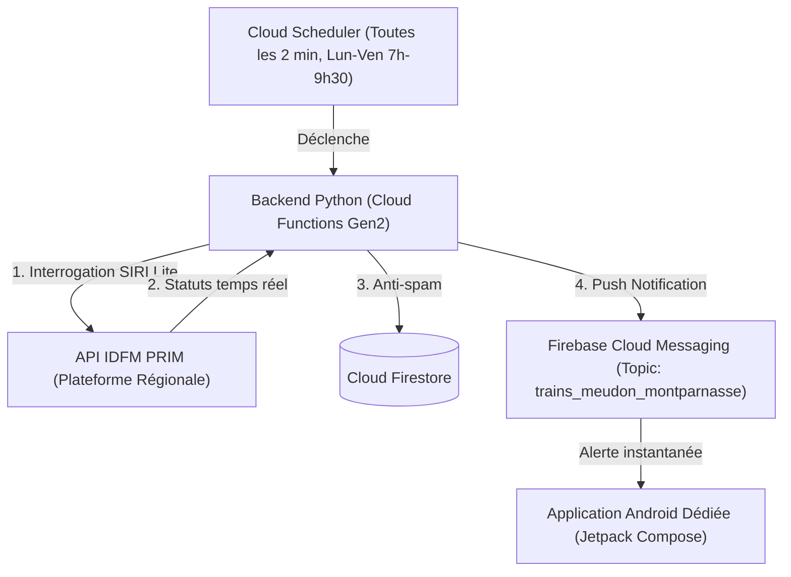

# 🚆 Null-Track — Alerte d'annulation Transilien Ligne N

**Null-Track** est un système d'alerte automatisé conçu pour surveiller les trains de la **Ligne N Transilien** au départ de **Meudon** vers **Paris-Montparnasse**.

Dès qu'une suppression ou annulation est enregistrée par la SNCF / Île-de-France Mobilités pendant la plage horaire définie (par défaut : **du lundi au vendredi, de 07h00 à 09h30**), une notification push haute priorité (avec sonnerie et vibration) est envoyée instantanément sur votre smartphone **Android**.

---

## 🏗️ Architecture du projet



---

## 📁 Structure du répertoire

```text
null-track/
├── backend/
│   ├── config.py              # Configuration (horaires, gare de Meudon, filtres)
│   ├── monitor.py             # Logique d'appel API PRIM et détection d'annulations
│   ├── firestore_client.py    # Déduplication des alertes dans Firestore
│   ├── fcm_client.py          # Envoi des push notifications via topic FCM
│   ├── main.py                # Point d'entrée HTTP (Cloud Functions / Cloud Run)
│   ├── test_local.py          # Script de test local (simulation et live)
│   ├── requirements.txt       # Dépendances Python
│   ├── Dockerfile             # Conteneur pour Cloud Run
│   └── .env.example           # Template pour vos clés locales
├── android/
│   ├── app/
│   │   ├── src/main/java/com/nulltrack/
│   │   │   ├── MainActivity.kt                  # Écran principal & permissions
│   │   │   ├── service/NullTrackMessagingService.kt # Réception push FCM & canal d'alerte
│   │   │   ├── ui/HomeScreen.kt                 # Interface Jetpack Compose
│   │   │   └── data/AlertRepository.kt          # Historique et persistance locale
│   │   └── build.gradle.kts
│   └── build.gradle.kts
├── deploy/
│   └── deploy_gcp.sh          # Script de déploiement automatique sur GCP
└── README.md
```

---

## 🔑 1. Obtenir votre clé API IDFM PRIM (Gratuit)

1. Rendez-vous sur le portail [PRIM Île-de-France Mobilités](https://prim.iledefrance-mobilites.fr/).
2. Créez un compte gratuit si vous n'en avez pas déjà un.
3. Allez dans votre profil développeur / **Mes clés API**.
4. Copiez votre clé API (`apiKey`).

---

## 🔥 2. Configuration Firebase

1. Ouvrez la [Console Firebase](https://console.firebase.google.com/).
2. Créez un projet (ou sélectionnez un projet GCP existant).
3. Activez **Cloud Firestore** en mode Natif.
4. Ajoutez une application **Android** :
   - Nom du package : `com.nulltrack`
   - Téléchargez le fichier `google-services.json` généré.
   - Placez ce fichier dans le dossier `android/app/google-services.json`.

---

## 💻 3. Tester localement

Vous pouvez tester l'ensemble du mécanisme directement depuis votre terminal sans attendre le déploiement.

### A. Test en mode simulation (sans clé API)
```bash
python3 backend/test_local.py
```
Ce test simule un train fictif annulé (`ROPO` à 08h12 vers Montparnasse) et valide la détection ainsi que la déduplication anti-spam.

### B. Test avec l'API réelle en direct
Créez un fichier `backend/.env` contenant :
```env
PRIM_API_KEY=votre_cle_api_prim
FORCE_CHECK=true
```
Puis lancez :
```bash
python3 backend/test_local.py --real
```
Le script affichera les prochains départs réels depuis la gare de Meudon ainsi que le statut des trains vers Montparnasse.

---

## ☁️ 4. Déploiement sur Google Cloud

Le script `deploy/deploy_gcp.sh` automatise le déploiement de la Cloud Function Gen2 et la programmation du Cloud Scheduler :

```bash
export GCP_PROJECT_ID="votre-projet-id"
export PRIM_API_KEY="votre-cle-api-prim"

chmod +x deploy/deploy_gcp.sh
./deploy/deploy_gcp.sh
```

Le cron s'exécutera automatiquement **toutes les 2 minutes du lundi au vendredi entre 07h00 et 09h30** (fuseau horaire de Paris).

---

## 📱 5. Lancer l'application Android

1. Ouvrez le dossier `android/` dans **Android Studio**.
2. Assurez-vous que `android/app/google-services.json` est bien présent.
3. Branchez votre smartphone Android (ou lancez un émulateur).
4. Cliquez sur **Run** (`Shift + F10`).
5. À l'ouverture de l'application :
   - Acceptez l'autorisation des notifications.
   - L'application s'abonne automatiquement au topic `trains_meudon_montparnasse`.
   - Utilisez le bouton **"Tester une alerte push"** pour vérifier la sonnerie, la vibration et l'affichage de l'alerte.

---

## ⚙️ 6. Personnalisation

Tous les paramètres sont configurables dans `backend/config.py` ou via des variables d'environnement Cloud Functions :

| Variable | Description | Valeur par défaut |
| :--- | :--- | :--- |
| `PRIM_MONITORING_REF` | Identifiant StopArea IDFM de la gare | `STIF:StopArea:SP:43162:` (Meudon) |
| `DESTINATION_FILTER` | Mot-clé destination | `Montparnasse` |
| `START_HOUR` / `START_MINUTE` | Début de la surveillance | `7`h `00` |
| `END_HOUR` / `END_MINUTE` | Fin de la surveillance | `9`h `30` |
| `ACTIVE_DAYS` | Jours actifs (0=Lun, 4=Ven) | `0,1,2,3,4` |
| `FCM_TOPIC` | Nom du topic Firebase | `trains_meudon_montparnasse` |
